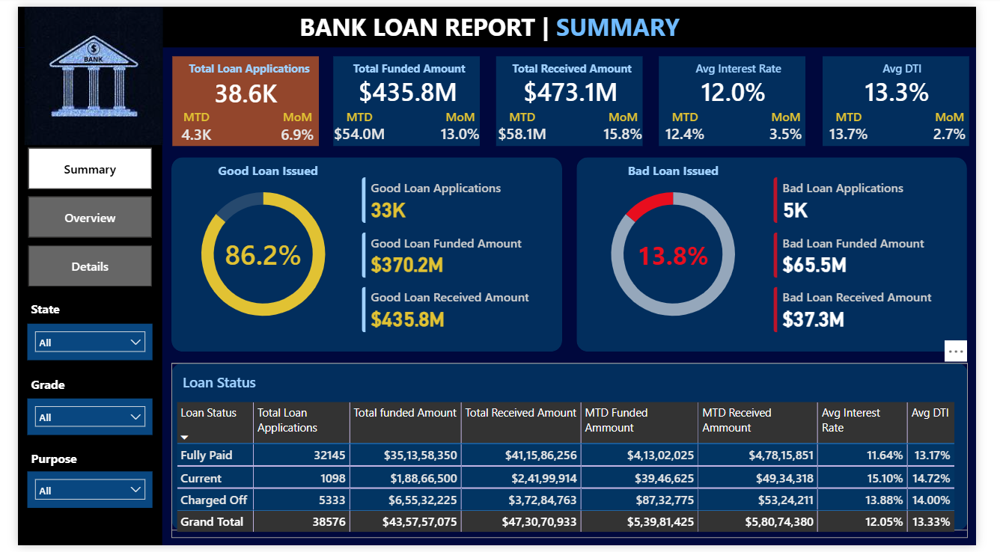
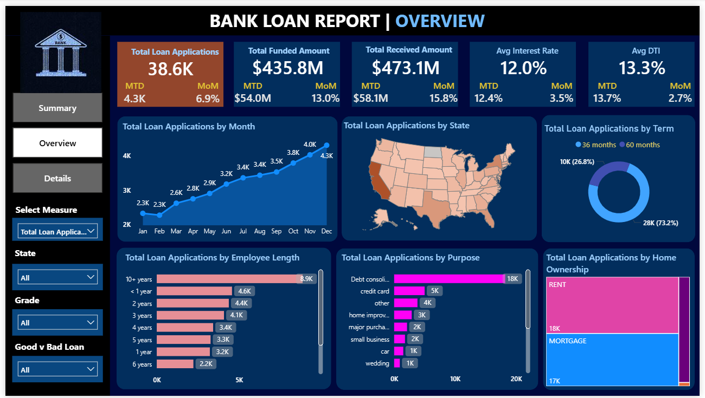
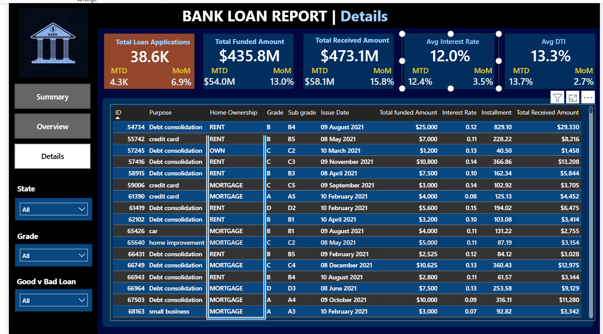

# 🏦 Bank Loan Report | Power BI Dashboard

An interactive Power BI dashboard analyzing bank loan performance across 3 pages Summary, Overview, and Detailsvtracking loan quality, trends, KPIs, and borrower insights with dynamic filters.

---

## 📊 Dashboard Pages

### 1. Summary

A high-level snapshot of the loan portfolio, classifying loans into **Good** and **Bad** segments. Includes MTD(Month to Date) and MoM(Month on Month) comparisons for key KPIs and a detailed breakdown by loan status Fully Paid, Current, and Charged Off.

---

### 2. Overview

Visual trend analysis across multiple dimensions:
- Monthly loan application volume
- Geographic distribution by U.S. state
- Loan term split (36 vs 60 months)
- Applications by employment length
- Loan purpose breakdown
- Home ownership distribution

---

### 3. Details

Granular, row-level view of individual loans with attributes including grade, sub-grade, issue date, funded amount, installment, interest rate, and total received amount.

---

## 📌 Key KPIs Tracked

| Metric | Description |
|---|---|
| Total Loan Applications | Count of all loan applications with MTD & MoM |
| Total Funded Amount | Total principal disbursed with MTD & MoM |
| Total Received Amount | Total repayments received with MTD & MoM |
| Avg Interest Rate | Average interest rate across all loans |
| Avg DTI | Average Debt-to-Income ratio of borrowers |

---

## ✅ Good Loan vs ❌ Bad Loan

| Category | Description |
|---|---|
| **Good Loan** | Loans with status — Fully Paid or Current |
| **Bad Loan** | Loans with status — Charged Off |

---

## 🔍 Filters & Slicers

The dashboard supports dynamic filtering across:
- **State** — Filter by U.S. state
- **Grade** — Filter by loan grade (A to G)
- **Purpose** — Filter by loan purpose
- **Good vs Bad Loan** — Isolate portfolio segments

---

## 🛠️ Tools & Skills Used

- **Power BI Desktop** — Dashboard design and development
- **DAX** — Custom measures for KPIs, MTD, MoM calculations
- **Power Query** — Data cleaning and transformation
- **Data Modeling** — Relationships and schema design
